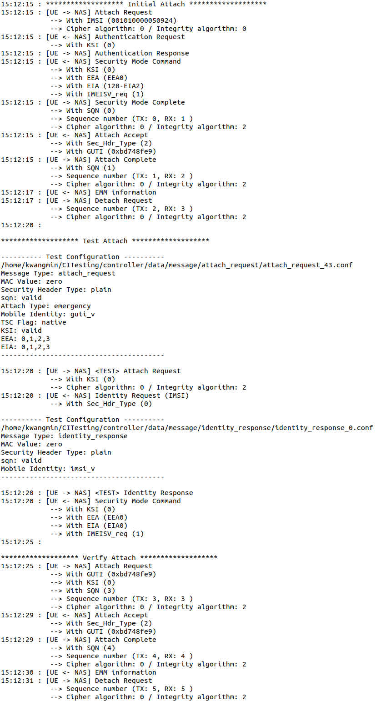

Overview
=======

**CITesting** is a framework built on top of the [srsRAN project](https://www.github.com/srsran/srsran_project)’s srsUE to systematically detect context integrity violations (CIVs) in LTE core networks. The primary goal of CITesting is to evaluate whether unauthenticated or improperly authenticated UE messages can modify the internal state of legitimate subscribers.

It selects test cases through **specification-guided selections**. Based on these generated messages, CITesting then automatically explores procedures by producing all valid procedure-compliant responses to core network requests.  
CITesting adopts a **dual-UE architecture**, with a victim UE controlled across different states (CONN., IDLE, DEREGI.) and a tester UE that sends test messages to the core network. 

CIV detection is guided by a **behavioral oracle**: after each exploration sequence, the victim UE performs state-specific service attempts, and deviations from expected responses are flagged as context modifications.  

For more details, please refer to our paper.

Prerequisites
=======
- **Operating System**: Ubuntu 20.04 LTS
- **Hardware**: Two USRPs (B200 or B210)
- **Dependencies**: srsRAN, UHD Driver, Python 3.8+
- **SIM Card (optional)**: A programmable SIM card (e.g., SysmoISIM-SJA2) that enables the LTE radio connection and allows the victim UE to attach to the test core network

Installation
=======

### 1. Install UHD Library
**UHD dependencies:**
```bash
sudo apt update
sudo apt-get install autoconf automake build-essential ccache cmake cpufrequtils doxygen ethtool \
g++ git inetutils-tools libboost-all-dev libncurses5 libncurses5-dev libusb-1.0-0 libusb-1.0-0-dev \
libusb-dev python3-dev python3-mako python3-numpy python3-requests python3-scipy python3-setuptools \
python3-ruamel.yaml
```
**Clone and build UHD from source** (Recommended the LTS version of UHD)
```bash
git clone https://github.com/EttusResearch/uhd.git
cd uhd/host
mkdir build
cd build
cmake ../
make -j8
make test
sudo make install
sudo ldconfig
```

**Download USRP firmware and FPGA images**
```bash
sudo uhd_images_downloader
```
**Test USRP connection**
```bash
sudo uhd_find_devices
sudo uhd_usrp_probe
```
For more detail, please refer to the official UHD installation homepage. (https://files.ettus.com/manual/page_build_guide.html)

### 2. Install Another Dependency

**Python library dependencies**
```bash
pip3 install configparser pathlib
```
If additional Python standard library dependencies are missing in your environment, you can install them using `pip3 install <library_name>`.  

**Third-party libraries**:  
  - `pandas`  
  - `colorlog`  

### 3. Build CITesting from Source
CITesting is implemented on top of srsUE, the open-source UE provided by the srsRAN project. Therefore, it follows the dependencies of srsRAN. 

**Install dependency**

For installing these dependencies, please refer to the official srsRAN documentation: https://docs.srsran.com/projects/4g/en/latest/general/source/1_installation.html#gen-installation

**Download the CITesting source code, then**
```bash
cd CITesting
mkdir build
cd build
cmake ../
make -j$(nproc)
sudo make install
srsran_install_configs.sh user
```
### 4. Program the SIM Card (optional)
Using a programmable SIM card is optional in CITesting.  
This SIM card is used to establish the LTE connection between the victim UE and the test core network.
You can either write the USIM information directly into a configuration file or use a programmed SIM card with a SIM reader.  
Please refer to the [srsRAN documentation](https://docs.srsran.com/projects/project/en/latest/tutorials/source/cotsUE/source/index.html#sim-programming) for instructions on how to program the SIM card. 
The information programmed into the USIM must also be registered with the test core network.

Run CITesting
======= 
### 1. Copy and Set Configuration File
```bash
cd controller
cd config
mv ue_victim.conf ../../build/srsue/src/ue_victim.conf
mv ue_attacker.conf ../../build/srsue/src/ue_attacker.conf
```
**Set configuration file** 

To set the configuration file, the target core to be tested must be executed, and the required configuration values should be obtained from it.

- In `ue_victim.conf`:  
  - When using `usim.mode = soft`, you must provide the values for `usim.imsi`, `usim.k`, and `usim.opc` of the victim UE.  
  - When using `usim.mode = pcsc`, insert a programmed SIM card into a SIM reader, and the information will be read automatically.  

- In `ue_attacker.conf`:  
  - The `usim.mode` must always be set to `soft`.  
  - The `usim.imsi` should be configured with the IMSI value of the victim’s USIM.  
- Set `device_name` to `"uhd"`.  
- Configure the `device_args` parameter according to your UHD device.  
  You can list available options using the `uhd_find_devices` command.  
  For example:  
  ```bash
  device_args = type=b200,serial=A12DB24
  ```
- Set `earfcn` parameter to the value that corresponds to your target core network frequency.
- In the **CONN.** state, set the `testing_ip` parameter to add a default route for the UE in order to verify connectivity with the network.  
  
For more details, please refer to the [srsRAN documentation](https://docs.srsran.com/projects/project/en/latest/tutorials/source/srsUE/source/index.html#testing-the-network).


### 2. Execute Generator

Run the generator to produce the messages and configuration files required for testing.
```bash
python3 generator.py -c <core_network_name> -s <type_of_state>
```
After running `generator.py`, the following files and directories are created:  

- `./data/message/`  
  Contains message structures with Information Element (IE) values that are used for testing.  

- `./data/<core_network_name>/`  
  Stores the configuration files required for running tests against the specified core network.  

- `./data/<core_network_name>/config/<core_network_name>_depth1_<type_of_state>_<initial_message_type>/`  
  Contains the root-level configuration files for testing. This directory is used as the input when executing tests.  (`<initial_message_type>` represents the type of initial NAS message (*e.g.,* `attach`, `detach`, `tau`, or `sr`)).  

### 3. Execute Controller

The controller coordinates the dual-UE architecture, manages victim and tester UE execution, triggers the behavioral oracle, and invokes the `log_parser` to explore procedures and detect CIVs.

- A baseline behavior for oracle is required to determine whether a CIV has occurred. The expected responses in the absence of CIVs should be stored in the `./normal_response/` directory.  


To execute a test, run the controller with the following command:  

```bash
sudo python3 controller.py -e -tc <root-level_conf_dir> -state <type_of_state> -c <core_network_name> -i <initial_message_type>
```
- <root-level_conf_dir>: Directory containing the root-level configuration files generated by `generator.py`.

- <type_of_state>: The target state of the victim UE (CONN, IDLE, or DEREGI).

- <core_network_name>: The target core network to be tested (e.g., open5gs).

- <initial_message_type>: The type of initial NAS message (attach, detach, tau, sr).
  

CITesting's Output
=======

### Log File Structure
<details>
<summary>Click to expand log image (An example test conducted in the DEREGI state.)</summary>
<div style="max-height:400px; overflow-y:auto;">

</div>
</details>

- **Initial Attach**:
  Shows the result of the attach procedure used to control the victim UE into the target state.  
- **Test Attach**: 
  Shows the result of the tester UE sending a test message defined in the configuration.  
- **Verify Attach**:
  Shows the result of the victim UE performing a state-specific service attempt to verify whether a CIV has occurred. (When the victim UE is in the **CONN.** state, connectivity is checked using a ping request, so the result is not recorded in the log file. Therefore, the results of the ping request are stored in the `./ping_detection` directory.)

### Directory Structure

As a result of the `log_parser` internally executed by the controller, logs are classified into three categories: 
- **abnormal**: Contains log files where deviations from the baseline are observed, indicating potential CIVs.  
- **normal**: Contains log files where no CIV has occurred.  
- **fatal_error**: Contains log files that are malformed and cannot be analyzed due to errors such as *Radio Link Failure*.  

These categorized logs are stored in the original log directories with a suffix indicating the result.  
(*e.g.,* ./data/open5gs/log/open5gs_depth1_DEREGI_attach_**abnormal**/)

CITesting's Source Code
=======

`CITesting/srsue/src/stack/upper/nas.cc`
- Manages the execution of the victim and tester UEs and coordinates the **flow of test messages**.
- Sets and propagates **runtime flags** required by the test flow. 
- Parses and sets the **message configuration** for testing.
- **Transmits** test messages.

`CITesting/srsue/src/stack/upper/lte_test.cc`
- Constructs **message structures** for testing based on values specified in the **configuration files** 
  
`CITesting/controller/controller.py`
- Orchestrates the **dual-UE architecture**
- Runs the `log_parser` to analyze stored logs, **continue procedure exploration** with procedure-compliant responses when the core network issues requests, and determine **CIV** outcomes for each procedure chain. 
  
`CITesting/controller/log2csv.py`
- A utility program that converts stored logs into CSV format for CIV categorization. 
  
```bash
python3 log2csv.py -i <log_file_path> -o <csv_file_path> 
```
- `<log_file_path>` refers to the directory path where logs are stored
- `<csv_file_path>` specifies the location where the converted CSV file will be saved. 
  
`CITesting/controller/CIV_categorization.py`
- A utility program that categorizes detected CIVs.  

```bash
python3 CIV_categorization.py -f <csv_file_path> 
```
- `<csv_file_path>` refers to the CSV file generated by `log2csv.py`
